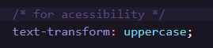

# Frontend Mentor - 3-column preview card

This is a solution to the [3-column preview card component challenge hub](https://www.frontendmentor.io/challenges/3column-preview-card-component-pH92eAR2-). Frontend Mentor challenges help you improve your coding skills by building realistic projects.

### Web Version

### Mobile Version

### Built with

- Semantic HTML5 markup
- CSS custom properties
- Grid
- Flexbox

### What I Learned

## Acessibility

- Uppercase text with CSS to made screen readers spell word letter by letter

- That decorative images should have no `alt =` text and `aria-hidden="true"` to make all web assistive technologies ignore this image

## 🚀 Starting

To start the project, just open the file `index.html` in your preferred browser.

## Author

- Linkedin - [Daniel Barbosa](https://www.linkedin.com/in/danielbarbosadefreitas/)
- Frontend Mentor - [@Danielhu3](https://www.frontendmentor.io/profile/Danielhu3)
